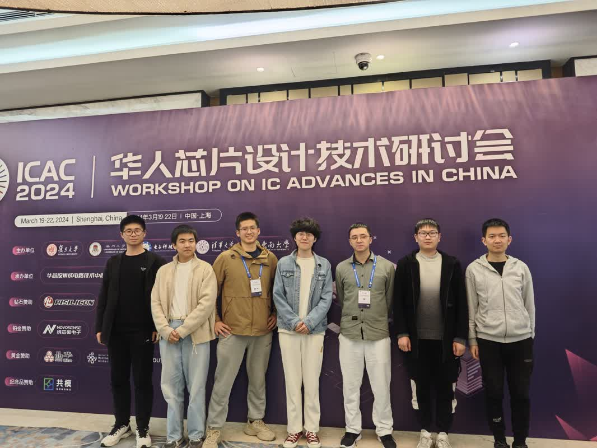

I am thrilled to have the opportunity to engage with the [ICAC](https://icacworkshop.cn/)'24, where I will have the privilege of hearing from leading experts across diverse disciplines and engaging in meaningful discussions with them.

Here are some quick thoughts:
- The majority of research papers from China in the realm of top-tier solid-state circuit design concentrate on fields like RF circuits, data converters, and similar technologies. However, there remains a significant opportunity for Chinese contributions in domains like CPU and GPU design. (Inspired by [Prof. Yuan Xie](https://ece.hkust.edu.hk/yuanxie))
- In-memory computing is gaining immense popularity and shows great promise. However, its transition to a commercial product hinges on identifying a "killer application" that would catalyze further opportunities and advancements in compute-in-memory technologies. Given the significant benefits that GPUs offer, such as versatility and computational power in cloud environments, the true potential of compute-in-memory systems may lie in edge computing. Here, power efficiency is paramount, and the capability for task-specific acceleration could meet the critical needs of various applications. (Inspired by Prof. [Fengbin Tu](https://ece.hkust.edu.hk/fengbintu))
- Analog in-memory computing has the potential to significantly enhance compute density and power efficiency. However, further technological advancements are required to address challenges related to yield and variability. (Inspired by Prof. [Ming Liu](https://fics.fudan.edu.cn/36/80/c22618a276096/page.htm))

A photo of me and members in [ICSL Lab](https://iscl.nju.edu.cn/main.psp) attending the conference:
